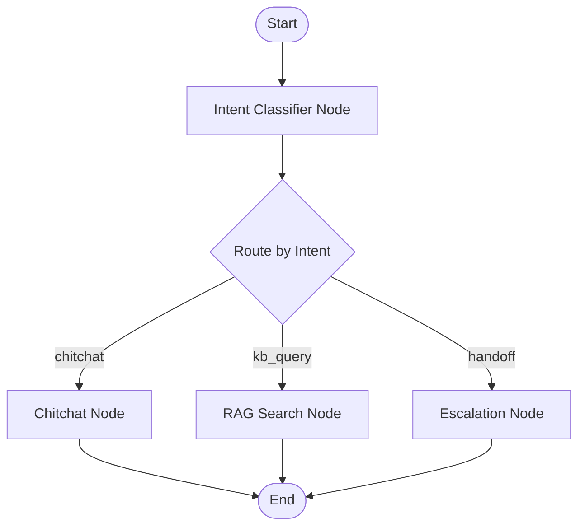
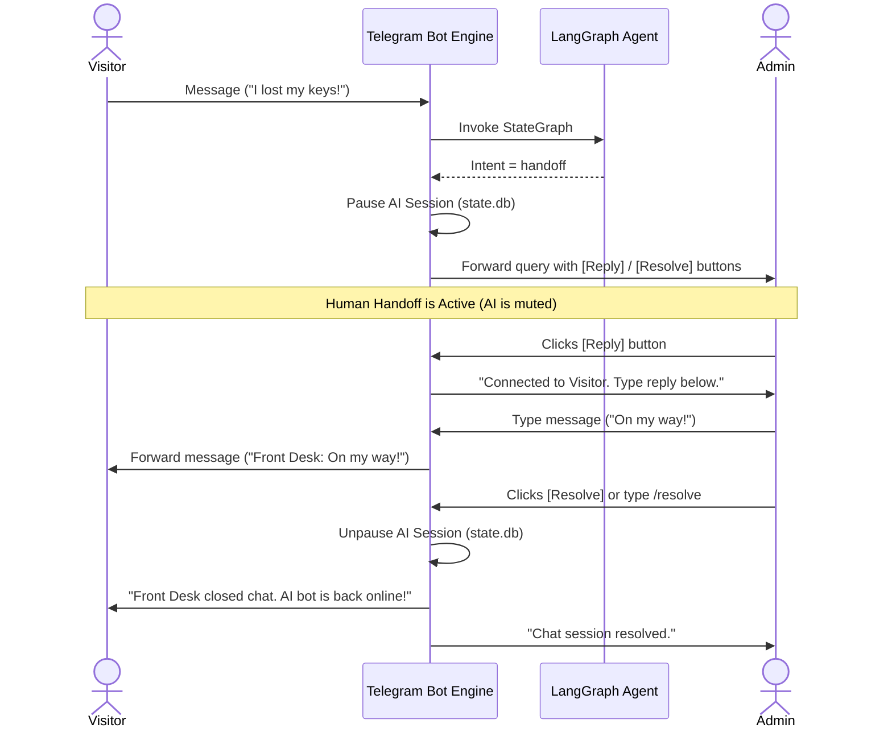

# Design Document: Front Desk Telegram Agent (Python & LangGraph - Standalone Packaging Architecture)

This document outlines the architecture, file structure, developer roles, and deployment plan for building a front desk agent bot on Telegram that answers queries based on local markdown files.

This system is structured as a **Builder & Runtime Platform**:
1. **The Codebase**: A generic Python application (`core/`) containing the bot runner, LangGraph agent, and search index query service.
2. **The Builder**: A packaging script (`utility/build.py`) that compiles a business owner's local directory (containing their configuration and raw Markdown documentation) and generates a self-contained, deploy-ready ZIP file inside the workspace folder (defaults to `<src_dir>/deploy.zip`).

---

## 1. High-Level Architecture

The repository acts as a build-agent. It ingests client configurations from a local folder, compiles the search vectors, and outputs a flat, standalone package that runs natively in production.

```
┌────────────────────────────────────────────────────────┐
│                  Developer Machine                     │
│                                                        │
│  ┌──────────────────┐          ┌────────────────────┐  │
│  │ Client Workspace │          │   Shared Codebase  │  │
│  │ (data/ & .env)   │          │      (core/)       │  │
│  └────────┬─────────┘          └─────────┬──────────┘  │
│           │                              │             │
│           └──────────────┬───────────────┘             │
│                          ▼ Run build.py                │
│            ┌───────────────────────────┐               │
│            │  Compiler & Zip Packager  │               │
│            └─────────────┬─────────────┘               │
└──────────────────────────┼─────────────────────────────┘
                           │
                           ▼ Outputs Standalone ZIP
             ┌───────────────────────────┐
             │    deploy_business.zip    │
             └─────────────┬─────────────┘
                           │ Upload & Unzip
                           ▼
┌────────────────────────────────────────────────────────┐
│                   Production VPS                       │
│                                                        │
│  ├── main.py (Starts bot polling loop)                 │
│  ├── requirements.txt                                  │
│  ├── .env (Configured keys & caps)                     │
│  ├── state.db (Local memory sqlite)                    │
│  └── index/ (Pre-compiled FAISS vector files)          │
└────────────────────────────────────────────────────────┘
```

---

## 2. Repository Directory Structure

```text
frontdesk/
├── requirements.txt            # Project dependencies (langgraph, python-telegram-bot, langchain, etc.)
├── README.md                   # Setup instructions
├── DESIGN.md                   # This document
├── core/                       # Core parameter-free bot runner code
│   ├── main.py                 # App entrypoint (looks for .env and index/ in its execution directory)
│   └── src/
│       ├── __init__.py
│       ├── config.py           # Loads settings from the local .env file
│       ├── telegram_bot/       # [Developer A] Telegram bot handlers and admin relay
│       │   ├── __init__.py
│       │   ├── bot.py          # Message routing, rate limiter check, and inline buttons
│       │   └── session.py      # SQLite session mapping (linking admin state to visitor chats)
│       ├── agent/              # [Shared/Developer A] Core Orchestrator Logic
│       │   ├── __init__.py
│       │   ├── orchestrator.py # LangGraph Intent Router StateGraph setup
│       │   ├── state.py        # TypedDict state structure
│       │   └── prompt.py       # Classifier & Responder system prompts
│       └── search/             # [Developer B] FAISS search service
│           ├── __init__.py
│           └── service.py      # Loads local FAISS vectors and queries them
└── utility/                    # Compiler utilities
    ├── build.py                # Compiles client folder and zips a deployable package
    └── crawl.py                # Crawls website and downloads page content to MD files
```

---

## 3. The Bot Compiler & Packaging Mechanism (`utility/build.py`)

The builder script handles both **initialization** of a client workspace and **packaging** of a completed client bot.

### A. Initializing a Client Workspace
To generate template configurations and sample markdown files in a target directory:
```bash
python3 utility/build.py --init /path/to/haircuts_workspace
```
Optionally, pass a website URL (`--url`) during initialization to automatically crawl the site and populate the workspace with real business pages instead of placeholder templates:
```bash
python3 utility/build.py --init /path/to/haircuts_workspace --url https://munjelaglow.com/
```
**Action**:
1. Creates the target directory `/path/to/haircuts_workspace` (if it does not exist).
2. Copies `.env.example` to `/path/to/haircuts_workspace/.env`.
3. Creates sample markdown files (`visitor_policy.md`, `faq.md`) inside the directory to serve as template documentation.

### B. Packaging a Client Bot
If `WEBSITE_URL` is set in the client's `.env` file, the builder script will automatically crawl that URL and save pages directly into the workspace to refresh the Markdown files before compiling the index.
Once the client config and documentation are populated, compile and bundle the bot:
```bash
python3 utility/build.py --src /path/to/haircuts_workspace
```
**Compiler Actions**:
1. **Load Keys**: Loads environment variables from the client's local `/path/to/haircuts_workspace/.env` to authenticate with embedding APIs.
2. **Compile Vector Index**: Reads all `.md` files in the client directory, generates semantic vector embeddings, and compiles them.
3. **Assemble Standalone Package**: Creates a temporary staging folder and copies:
   * The core bot engine files (`core/main.py` and `core/src/` placed flat at root).
   * The `requirements.txt`.
   * The client's specific `.env` file.
   * The compiled FAISS files placed inside an `index/` directory.
4. **Generate ZIP**: Compresses the staging directory into the output ZIP file, leaving out all developer scripts and raw Markdown documents.

### C. Auto-Generating Data from a Website (`utility/crawl.py`)
If the business already has an existing public website, developers can auto-generate the markdown files by running the crawler:
```bash
python3 utility/crawl.py --url https://example-salon.com --out /path/to/workspace
```
This crawls the site, strips header/footer menus, and downloads content as `.md` files.

---

## 4. Deployed Package Structure (Flat & Standalone)

Once `deploy_haircuts.zip` is extracted on the target server, it has a flat, simple structure that requires no tenant-switching flags or folder mappings:

```text
deploy_haircuts/
├── requirements.txt            # Package dependencies
├── .env                        # Secret credentials, caps, and rate limits
├── main.py                     # Runs the bot: "python3 main.py" (no arguments needed!)
├── state.db                    # SQLite file created at runtime to store chat history
├── index/                      # Pre-compiled FAISS vector search database
│   ├── index.faiss
│   └── index.pkl
└── src/                        # Bot code modules
    ├── config.py
    ├── telegram_bot/
    ├── agent/
    └── search/
```

---

## 5. Agent State Machine & Handoff Flow

The bot uses LangGraph to orchestrate a deterministic agent state machine. The orchestrator classifies the visitor's intent and routes them dynamically:

### A. State Diagram (Mermaid)



### B. Node Execution Details
1. **Intent Classifier Node**: Sends the user's query and the chat history to the Gemini model using `CLASSIFIER_PROMPT`. The model must output exactly one of three categories: `chitchat`, `kb_query`, or `handoff`.
2. **Chitchat Node**: Handles greetings, polite phrases, and general small talk. Generates a warm, professional, and very brief reply (1-2 sentences).
3. **RAG Search Node**: Queries the local FAISS database (using `GoogleGenerativeAIEmbeddings` models/gemini-embedding-001) for the top 3 matches. Injects them into `RESPONDER_PROMPT` to formulate a factual response.
   * *Fallback*: If the retrieved context cannot answer the question, the node outputs a standard response: *"I couldn't find the answer to that in our files. Let me escalate this to our staff to help you directly."*, which triggers a handoff in the bot loop.
4. **Escalation Node**: Signals to the bot engine that the conversation must be paused and redirected to a human.

### C. Human Handoff & Admin Relay Sequence

The Telegram bot acts as an intermediary, routing messages between the Visitor, the LLM Agent, and the Admin:



---

## 6. Cost Protection & Spam Guardrails

To protect business owners from runaway API costs and spam, the Telegram Bot Handler (`src/telegram_bot/bot.py`) executes two lightweight database checks *before* calling the LangGraph AI model. If a check fails, a static text message is returned, incurring $0.00 in LLM costs.

### A. User Spam Protection (Rate Limiting)
* Every time a visitor sends a message, their `chat_id` and timestamp are written to the `rate_limiter` table in the local `state.db`.
* If a visitor sends more than the allowed rate (e.g. `USER_RATE_LIMIT=5` messages per 60 seconds), the bot returns:
  > *"You are sending messages too quickly. Please wait a moment."*

### B. Daily Tenant Cap (API Circuit Breaker)
* The bot tracks the total number of AI messages processed for the tenant during the current calendar date in the `daily_usage` table.
* If the count reaches `DAILY_MESSAGE_CAP` (configured in the tenant's `.env`, e.g. 200), the AI graph is bypassed. The bot automatically replies:
  > *"Our automated assistant has reached its maximum query limit for today. If you need immediate assistance, please call our front desk."*
* The bot also sends a one-time notification to the owner (`ADMIN_CHAT_ID`):
  > *"⚠️ **Alert:** Your bot has reached its daily cap of 200 messages. Automated responses are suspended until tomorrow."*

---

## 7. Work Breakdown between Developers

### 🧑‍💻 Developer A: Flat Telegram Bot, State & Protection Guardrails
* **Deliverables**: `core/main.py`, `core/src/config.py`, `core/src/telegram_bot/*`, `core/src/agent/*`.
* **Key Tasks**:
  1. Set up the `python-telegram-bot` polling loop in `core/main.py`.
  2. Implement state checkpointing using `SqliteSaver` directed to a local `./state.db`.
  3. Write the **Classifier LLM Node** and conditional routing edge logic inside `core/src/agent/orchestrator.py`.
  4. Implement the logic to pause the AI when `handoff` is triggered and send the interactive alert to `ADMIN_CHAT_ID`.
  5. Setup the `CallbackQueryHandler` in the Telegram Bot to process click actions for `[💬 Reply]` and `[✅ Resolve]` buttons.
  6. Implement the local Daily Message Cap and Rate Limiting database checks.

### 🧑‍💻 Developer B: Search Service, Build & Crawl Scripts
* **Deliverables**: `core/src/search/*`, `utility/build.py`, `utility/crawl.py`.
* **Key Tasks**:
  1. Write `utility/build.py` to automate Markdown parsing, FAISS compilation, file staging, and standalone ZIP packaging.
  2. Write `utility/crawl.py` to recursively parse website HTML and convert page body content into clean Markdown files.
  2. Write `core/src/search/service.py` to load the compiled FAISS vector index from the local `/index` folder in RAM and handle query queries.
  3. Set up mock business files locally to verify the build script output.

---

## 8. Integration Contract (The API Agreement)

Developer B provides the search utility:
```python
# core/src/search/service.py

def query_knowledge_base(query: str) -> str:
    """
    Load the index file located at the local /index directory and return matching text.
    """
    # Query logic loading from local "./index/"
    return results
```

Developer A imports it inside the RAG Graph Node:
```python
# core/src/agent/orchestrator.py
from core.src.search.service import query_knowledge_base

def search_respond_node(state: AgentState):
    user_query = state["messages"][-1].content
    
    # Programmatic RAG search from local index
    context = query_knowledge_base(user_query)
    
    # LLM Synth response
    response = call_synth_llm(user_query, context)
    return {"messages": [response]}
```

---

## 9. How to Test & Deploy a Business Bot

### Step 1: Set up the Local Workspace
```bash
python3 -m venv .venv
source .venv/bin/activate
pip install -r requirements.txt
```

### Step 2: Initialize the Client Workspace Folder
Use the builder script to automatically generate the template folder structure on your laptop (e.g. `/Users/username/desktop/haircuts_config/`):
```bash
python3 utility/build.py --init /Users/username/desktop/haircuts_config/
```
### Step 4: Run and Test Locally

Developers have two ways to run the bot locally on their laptops:

#### Method A: Direct Local Development (For editing code)
If a developer is actively writing code in `core/` and wants to test changes immediately without rebuilding the ZIP:
1. Copy the `.env` file and the compiled `index/` directory from the client's folder (e.g. `/Users/username/desktop/haircuts_config/`) to the repository root (`frontdesk/`).
2. From the repository root, run:
   ```bash
   python3 core/main.py
   ```
   *The bot will start, using the local configuration and index files.*

#### Method B: Standalone Package Simulation (For verifying the ZIP)
To test the exact bundle that will go to production:
1. Create a test directory and unzip the package:
   ```bash
   unzip dist/deploy_haircuts.zip -d dist/test_deploy_haircuts/
   cd dist/test_deploy_haircuts/
   ```
2. Run the bot flat:
   ```bash
   python3 main.py
   ```
   *If the bot runs here, it is 100% verified and ready to deploy to the production VPS.*

---

## 10. Production Deployment on the VPS

1. Copy the compiled `dist/deploy_haircuts.zip` to the target VPS.
2. Log into the VPS, navigate to the folder, and extract it:
   ```bash
   unzip deploy_haircuts.zip
   ```
3. Install dependencies:
   ```bash
   pip install -r requirements.txt
   ```
4. Set up the systemd service (see Section 4) and start the bot:
   ```bash
   sudo systemctl start frontdesk-haircuts
   ```

---

## 11. Visual Formatting, Interactive Buttons & Resolved Q&A Cache

### A. Rich Visual Formatting & Cards
To optimize presentation for text-based chat channels like Telegram:
1. **HTML Parsing Mode**: The bot utilizes Telegram's HTML parse mode (`parse_mode="HTML"`) which allows clean styling. Raw markdown is parsed and cleaned using `format_for_telegram()`, translating bold (`**`), italic (`*`), code (` ` ` `), and headers into strict Telegram-compliant tags to avoid parse errors.
2. **Short Message Cards**: Long LLM answers are broken down into short paragraph blocks (bubbles of less than 800 characters) and sent as separate cards to make readability high.
3. **Progress Indicators**: When a visitor query is received, the bot immediately posts a temporary `🧠 Thinking...` message bubble. Once the response cards are ready, this message is updated/edited live with the first card, and subsequent cards are sent as new bubbles.

### B. Interactive Action Buttons
The bot dynamically injects interactive inline keyboard buttons at the bottom of messages based on context keywords:
* **Capabilities Welcome Card**: When the visitor calls `/start`, they get a friendly greeting showing the dynamic `BUSINESS_NAME` and `AGENT_NAME`, and presenting Call Us and View Map buttons immediately.
* **Contextual Buttons**: If the bot's response mentions contact information or phone numbers, it attaches a `📞 Call Us Now` button linking to `tel:<BUSINESS_PHONE>`. If it mentions location, directions, or Saratoga Ave, it attaches a `📍 View Map` button linking to `MAP_URL`.

### C. Persistent Resolved Q&A Cache
To prevent staff from being repeatedly disrupted by the same unanswerable questions:
1. **Escalation Capturing**: When a visitor is in an active handoff (AI is paused), the bot saves their latest unanswered query as a `pending_question` in the SQLite database `state.db`.
2. **Q&A Recording**: The first reply the Admin sends to this visitor is captured as the resolved answer and stored alongside the question in the `escalations_cache` table.
3. **Fuzzy Retrieval**: Future incoming messages are fuzzy-matched against this cache using `difflib.SequenceMatcher` (threshold > 0.85). On a hit, the bot replies instantly using the staff's previously recorded answer and bypasses the LLM entirely.

