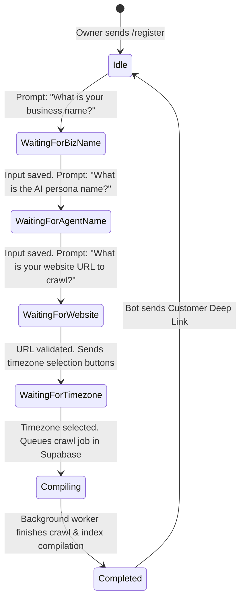

# Scaled Multi-Tenant Platform Architecture (Supabase & Telegram-Native Onboarding)

This document describes the design and specifications for scaling the single-tenant frontdesk assistant into a multi-tenant SaaS platform running off a single bot instance.

---

## 1. Overview & Core Flow

Instead of deploying a separate bot package per business, a single shared Telegram Bot (and upcoming WhatsApp webhook) handles incoming traffic for all businesses.

* **Tenant Differentiation**: Achieved via Telegram **deep linking** parameters (e.g., `t.me/your_bot?start=v_[business_id]`).
* **Instant Onboarding**: Business owners register their salon directly inside the Telegram Bot by invoking `/register`, avoiding complex web registrations.
* **Unified Database**: Local SQLite and local FAISS files are replaced with a centralized **Supabase (PostgreSQL + pgvector)** instance to handle relational settings and semantic searches concurrently.
* **Asynchronous Jobs**: Crawler execution is decoupled from message handlers. A database-backed task queue handles scraping and vector generation in a throttled background worker thread/process.

---

## 2. Telegram-Native Onboarding State Machine

The bot guides a registering business owner through a structured conversational questionnaire, tracking progress via an `onboarding_state` table:



### Onboarding Questionnaire Step-by-Step
1. **`/register`**: The bot initializes a registration session for the user's `chat_id`.
2. **Business Name**: (e.g., `"Munjela Glow"`) -> Normalizes name into a lowercase, URL-friendly unique slug `business_id` (e.g., `"munjelaglow"`).
3. **Agent Persona**: (e.g., `"Kim"` or `"Amanda"`) -> Configures the bot's name when greeting customers for this salon.
4. **Website URL**: (e.g., `"https://munjelaglow.com"`) -> The URL to crawl.
5. **Timezone**: Owner clicks an inline keyboard option containing standard timezones (e.g., `America/Los_Angeles`).
6. **Instant Ownership Binding**: The system registers the owner's Telegram `chat_id` as the authorized `admin_chat_id` for that `business_id`.
7. **Task Queueing**: A crawl job is added to the `crawl_jobs` table, and the owner is notified that their assistant is compiling.

---

## 3. Supabase Database Schema (Postgres + pgvector)

To support multiple businesses, we define a relational schema inside Supabase.

### A. `businesses` Table (Tenant Configurations)
Stores metadata for each business profile:
* `business_id` (TEXT, Primary Key) - The unique slug, e.g., `"dmhaircare"`.
* `business_name` (TEXT)
* `agent_name` (TEXT) - Custom persona.
* `website_url` (TEXT)
* `business_phone` (TEXT, Nullable) - Auto-extracted by crawler.
* `business_address` (TEXT, Nullable) - Auto-extracted by crawler.
* `map_url` (TEXT, Nullable) - Auto-generated from extracted address.
* `business_timezone` (TEXT) - e.g., `"America/Los_Angeles"`.
* `admin_chat_id` (TEXT) - Owner's Telegram chat ID.
* `created_at` (TIMESTAMPTZ)

### B. `visitors` Table (User Session Routing)
Maps customers chatting with the bot to the specific salon they visited:
* `visitor_chat_id` (TEXT, Primary Key)
* `active_business_id` (TEXT, Foreign Key -> `businesses.business_id`)

### C. `admin_relay` Table (Escalation Handoff Routing)
Manages active takeovers when a human admin is messaging a customer directly:
* `visitor_chat_id` (TEXT, Primary Key)
* `business_id` (TEXT, Foreign Key -> `businesses.business_id`)
* `is_paused` (BOOLEAN) - Mutes AI responses when human is active.
* `pending_question` (TEXT, Nullable) - Logs the visitor query to pair with the admin's reply.

### D. `knowledge_chunks` Table (Shared Vector Database)
Stores all RAG indexing data for all tenants:
* `id` (UUID, Primary Key)
* `business_id` (TEXT, Foreign Key -> `businesses.business_id`)
* `content` (TEXT) - Page text chunk.
* `embedding` (VECTOR(1536)) - Vector representations powered by `pgvector` (uses Gemini text embedding API).
* `metadata` (JSONB)
* *Index*: HNSW index on `embedding` for fast similarity searches.

### E. `escalations_cache` Table (Fuzzy Resolved Q&A Cache)
* `id` (BIGINT, Primary Key)
* `business_id` (TEXT, Foreign Key -> `businesses.business_id`)
* `question` (TEXT)
* `answer` (TEXT)
* `timestamp` (TIMESTAMPTZ)
* *Constraint*: Unique index on `(business_id, question)`

---

## 4. Asynchronous Crawler Queue & Background Worker

To handle long-running crawlers safely, we run a persistent task queue using Supabase.

### A. `crawl_jobs` Queue Table
* `id` (UUID, Primary Key)
* `business_id` (TEXT, Foreign Key -> `businesses.business_id`)
* `website_url` (TEXT)
* `status` (TEXT) - `'pending'`, `'processing'`, `'completed'`, `'failed'`.
* `error_message` (TEXT, Nullable)
* `created_at` / `updated_at` (TIMESTAMPTZ)

### B. The Background Worker (`worker.py`)
A separate, lightweight Python daemon process runs on the VPS to handle execution queues:

1. **Job Selection (Row Locking)**:
   The worker queries the queue using database locks to prevent race conditions:
   ```sql
   SELECT * FROM crawl_jobs 
   WHERE status = 'pending' 
   LIMIT 1 
   FOR UPDATE SKIP LOCKED;
   ```
2. **Crawl & Scraping**:
   Updates status to `'processing'` and runs the Crawl4AI scraper on `website_url`.
3. **Information Extraction**:
   Runs a structured Gemini model extraction on the crawled pages to identify:
   * The business phone number (standardized).
   * The physical street address.
   * Auto-writes these back to the `businesses` table.
4. **Vector Generation**:
   Generates Gemini embeddings for the new markdown page chunks.
5. **Database Transaction**:
   Deletes previous vector chunks for that business from `knowledge_chunks` and inserts the new embedding records.
6. **Callback Notification**:
   Changes job status to `'completed'` and (if `admin_chat_id` is set) messages the business owner on Telegram: *"🚀 Onboarding complete! Your customer link is ready: t.me/your_bot?start=v_[business_id]"*.

### C. Bulk Onboarding via Database Ingestion (`business_load` Table)
To support bulk registration of businesses outside Telegram (e.g., uploading a CSV sheet of salons directly to the Supabase dashboard):
1. **Staging Queue**: Business profiles are uploaded directly to the `business_load` table with a status of `'pending'`.
2. **Ingestion Loop**:
   * The background worker periodically scans for pending rows:
     `SELECT * FROM business_load WHERE status = 'pending'`
   * For each record, the worker:
     1. Creates the business profile entry in the `businesses` table.
     2. Automatically inserts a crawl job into the `crawl_jobs` table (which handles crawling, coordinates extraction, and vector index generation).
     3. Marks the row in `business_load` as `'completed'` and sets `processed_at = now()`.
3. **Dynamic Admin Binding**: If the `admin_chat_id` was left empty during the bulk upload, the business owner can activate their bot panel later by typing `/start a_[business_id]` to claim ownership.

---

## 5. Owner Management Command (`/settings`)

Once registered, an admin can send `/settings` to the Telegram bot to control their tenant configurations:
* **`🔄 Recrawl Website`**: Creates a new task inside `crawl_jobs` to refresh policies and vectors from their site.
* **`👤 Change Agent Name`**: Update the AI chatbot persona name.
* **`⚙️ Update Timezone`**: Change local timezone settings.
* **`📊 View Stats`**: Display monthly chat metrics.
