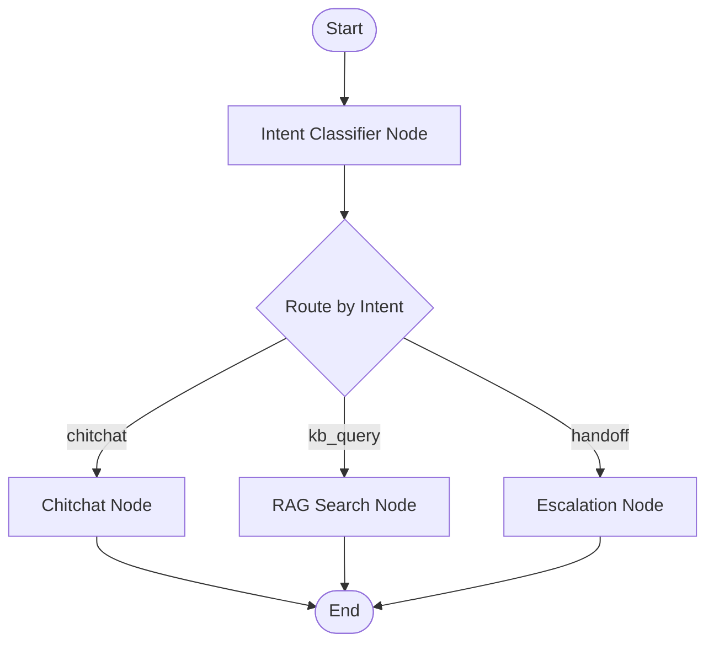
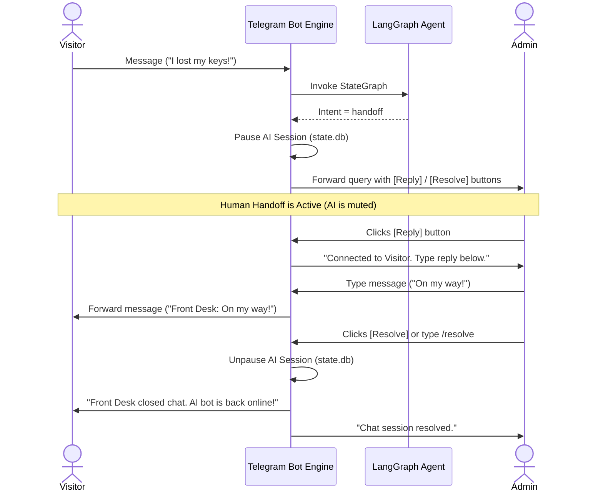

# Front Desk Telegram Bot (Python & LangGraph - Standalone Packaging Architecture)

This repository provides a multi-tenant compiler and standalone runtime engine for deploying front desk receptionist bots on Telegram. The bot answers visitor questions based on local Markdown policy files and supports automated human handoff when complex or sensitive issues arise.

---

## 1. Core Repository Structure

```text
frontdesk/
├── requirements.txt            # Python package dependencies
├── README.md                   # This file
├── DESIGN.md                   # Detailed architecture design document
├── core/                       # Shared bot runtime logic
│   ├── main.py                 # Bot runner (executes flat from unzipped deployable)
│   └── src/                    # Bot module code (agent, search loaders, config, and bot handlers)
└── utility/                    # Shared CLI tooling
    ├── build.py                # Workspace initializer & vector compiler / packager
    └── test_agent.py           # CLI-based local chat simulator
```

---

## 2. Quick Start (Local Development)

### Step 1: Install Dependencies
Create a virtual environment and install the required Python libraries:
```bash
python3 -m venv .venv
source .venv/bin/activate
pip install -r requirements.txt
```

### Step 2: Initialize a Client Workspace
Use the compiler script to initialize a new business workspace folder (e.g. `/Users/username/desktop/haircuts_config/`):
```bash
python3 utility/build.py --init /Users/username/desktop/haircuts_config/
```
Optionally, pass a website URL to automatically crawl the site and seed the workspace with Markdown pages during initialization:
```bash
python3 utility/build.py --init /Users/username/desktop/haircuts_config/ --url https://example-business.com/
```
This generates a template folder containing:
* `.env`: Configuration keys (Telegram token, Owner ID, Daily Cap, OpenAI API key).
* `visitor_policy.md` / `faq.md`: Sample Markdown documents.

### Step 3: Populate Configs & Data
If you want the build process to automatically crawl and refresh policy documents from a live website, set the `WEBSITE_URL` key inside your `.env` configuration:
```env
WEBSITE_URL=https://example-salon.com/
```
When you run the build command, it will automatically crawl the website and update the markdown files before compiling the vector search index.
1. Open the generated `/Users/username/desktop/haircuts_config/.env` and paste your API keys.
2. Edit or add any custom Markdown (`.md`) files inside the folder representing your client's business hours, policies, or procedures.

### Step 4: Build and Package
Compile the client's documents and build the standalone ZIP deployment package:
```bash
python3 utility/build.py --src /Users/username/desktop/haircuts_config/ --out deploy.zip
```
This writes the standalone, deploy-ready **`deploy.zip`** file.

---

## 3. Local Verification (CLI Simulator)

To test the bot's RAG queries, rate limiters, daily budget caps, and handoff flows locally in your terminal before deploying:
```bash
python3 utility/test_agent.py --src /Users/username/desktop/haircuts_config/
```
Type queries directly into the terminal prompt. You can simulate visitor inputs and the admin `/resolve` handoff commands in real-time.

---

## 4. Production Deployment

To run a client bot 24/7 on a production VPS:

1. Upload the generated `dist/deploy_<tenant_id>.zip` to the VPS.
2. Extract the archive:
   ```bash
   unzip deploy_<tenant_id>.zip -d /home/ubuntu/frontdesk/
   cd /home/ubuntu/frontdesk/
   ```
3. Install dependencies:
   ```bash
   python3 -m venv .venv
   source .venv/bin/activate
   pip install -r requirements.txt
   ```
4. Set up a **`systemd`** watchdog service to manage the bot process:
   ```bash
   sudo nano /etc/systemd/system/frontdesk.service
   ```
   Add the configuration:
   ```ini
   [Unit]
   Description=Front Desk Telegram Bot
   After=network.target

   [Service]
   Type=simple
   User=ubuntu
   WorkingDirectory=/home/ubuntu/frontdesk
   ExecStart=/home/ubuntu/frontdesk/.venv/bin/python main.py
   Restart=always
   RestartSec=5

   [Install]
   WantedBy=multi-user.target
   ```
5. Enable and start the service:
   ```bash
   sudo systemctl daemon-reload
   sudo systemctl enable frontdesk.service
   sudo systemctl start frontdesk.service
   ```

The bot will now run in the background, writing conversation backups to the local SQLite database `./state.db`.

---

## 5. Agent State Machine & Handoff Flow

The bot uses LangGraph to orchestrate a deterministic agent state machine. The orchestrator classifies the visitor's intent and routes them dynamically:

### A. State Diagram (Mermaid)



### B. Human Handoff & Admin Relay Sequence



---

## 6. Advanced Features: Cache, Buttons & Formatting

### A. Environment Configuration Settings
To enable the interactive formatting, cards, buttons, and resolved Q&A cache features, make sure your `.env` configuration file contains:
```env
# Salon Metadata
BUSINESS_NAME="DM Hair Care"
AGENT_NAME="Kim"

# Interactive Call & Location Maps
BUSINESS_PHONE="+14082105851"
BUSINESS_ADDRESS="1420 Saratoga Ave, San Jose, CA 95129"
MAP_URL="https://www.google.com/maps/search/?api=1&query=1420+Saratoga+Ave,+San+Jose,+CA+95129"
```

### B. Visual Presentation Cards & Formatting
The bot formats all replies for maximum readability in messaging apps:
1. **Telegram HTML Conversion**: Clean HTML (`<b>`, `<i>`, `<pre>`, `<code>`) is used for styling instead of raw markdown, preventing raw tag parse errors. Emojis are dynamically injected as bullet points (🔹) and visual headers.
2. **Thinking... Status Indicator**: The bot posts a temporary `🧠 Thinking...` message bubble, editing it live as soon as the response is ready.
3. **Card-Style Bubble Division**: Long responses are split at natural paragraph breaks into separate, consecutive message bubbles of under 800 characters, mimicking clean conversation cards.

### C. Contextual Action Buttons
The bot automatically attaches inline buttons under messages depending on context:
* **Welcome Card**: Visitors sending `/start` are greeted by name and business, and receive immediate Call Us and View Map buttons.
* **Smart Contact Buttons**: If the bot's response mentions contact numbers or locations, it automatically appends `📞 Call Us Now` and `📍 View Map` buttons at the bottom of the message card.

### D. SQLite Resolved Q&A Cache
If the staff resolves an escalated question, the bot dynamically caches the Q&A in `state.db`:
* **Automatic Capture**: When a staff member sends their first message to a paused visitor chat, the bot records the visitor's `pending_question` and pairs it with the admin's reply.
* **Fuzzy Database Lookup**: Before querying LangGraph, incoming messages are compared to this cache using fuzzy matching. On a match, the bot replies instantly with the cached answer, avoiding Gemini API costs and preventing staff from answering the same question twice!

