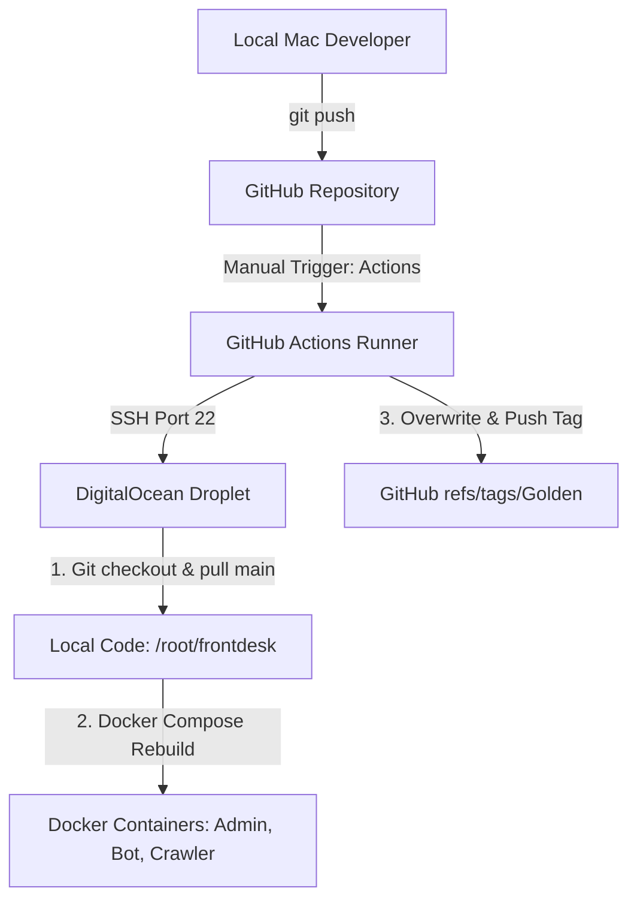
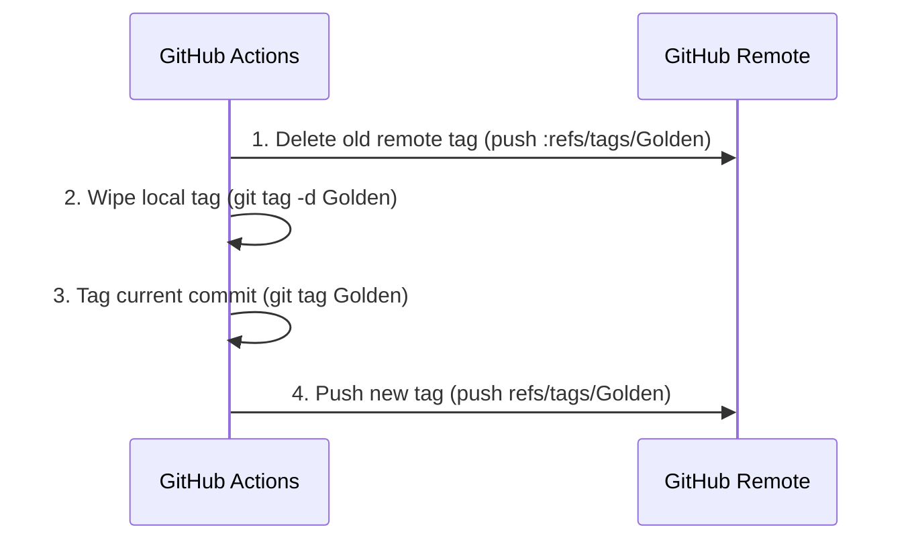

# SaaS Deployment & Release Management Guide

This document describes how to deploy updates to the production environment on the DigitalOcean Droplet, configure server variables, and track running versions via GitHub.

---

## 1. Deployment Architecture Overview



The system uses a **pull-based deployment model over SSH** managed by GitHub Actions:
* **Staged Development**: Main development takes place on the `scaled` branch.
* **Release Pipeline**: When a feature is stable and ready, it is merged into the `main` branch.
* **Manual CD Trigger**: The deployment pipeline on GitHub Actions is run manually on demand, targeting the `main` branch.

---

## 2. Triggering a Manual Deployment

Deployments do not trigger on pushes automatically. To release the latest merged code on `main` to your DigitalOcean droplet:

1. Open your browser and go to your **GitHub Repository**.
2. Click on the **Actions** tab in the top navigation bar.
3. In the left-hand menu, select **Deploy to DigitalOcean Droplet**.
4. On the right side, click the **Run workflow** dropdown button.
5. In the dropdown:
   * Leave the branch selection as **`main`**.
   * Click the green **Run workflow** button.
6. A new workflow run will appear in the list. Wait 1 to 2 minutes for it to complete.

---

## 3. SSH Deployment Sequence (On the Server)

When the workflow is triggered, the GitHub runner securely connects to your Droplet via SSH using the configured secrets (`DROPLET_IP` and `SSH_PRIVATE_KEY`) and executes the following script:

```bash
# 1. Navigate to the project directory or clone it if first run
cd /root/frontdesk || (git clone https://github.com/arjunmaganti/frontdesk.git /root/frontdesk && cd /root/frontdesk)

# 2. Align local copy with the main branch
git checkout main

# 3. Pull latest changes from origin
git pull origin main

# 4. Rebuild and restart the Docker stack
docker compose up -d --build
```

This sequence automatically updates and restarts the React Admin Console (port `80`), the Telegram Agent Service (port `8000`), and the Background Crawler Worker in the background.

---

## 4. The "Golden" Release Tagging Mechanism

To make it easy to know exactly which commit is currently running in production, the workflow contains a post-deployment step that updates the **`Golden`** tag on GitHub:



This sequence:
1. **Removes the old remote reference**: Deletes the `Golden` tag from your GitHub repository first (`git push origin :refs/tags/Golden`).
2. **Cleans up the local runner**: Deletes the `Golden` tag locally inside the runner workspace (`git tag -d Golden`).
3. **Re-creates the tag**: Creates a new lightweight `Golden` tag pointing to the commit that was just successfully deployed.
4. **Pushes the new tag**: Publishes it to origin (`git push origin refs/tags/Golden`).

You can check which release is in production at any time by viewing the **Tags** page on GitHub and looking for **`Golden`**.

---

## 5. Managing Environment Variables (`.env`) in Production

Production configuration files (such as database passwords, Telegram bot tokens, LLM model settings, and port parameters) are **not stored in GitHub** for security reasons. They live persistently on the Droplet.

To edit environment settings in production:

1. **Log in to the Droplet via SSH**:
   ```bash
   ssh root@<your_droplet_ip>
   ```
2. **Open and edit the `.env` file**:
   ```bash
   nano /root/frontdesk/.env
   ```
   *Modify any values like `TELEGRAM_BOT_TOKEN`, `TELEGRAM_BOT_NAME`, or `LLM_MODEL_NAME` as needed.*
   *Press `Ctrl + O` and `Enter` to save; `Ctrl + X` to exit.*
3. **Reload the Docker stack to apply configuration changes**:
   ```bash
   cd /root/frontdesk
   docker compose up -d
   ```
   *This command detects changes in the `.env` file and restarts only the affected containers (e.g. `frontdesk-bot` and `frontdesk-crawler`) without having to build from scratch.*
