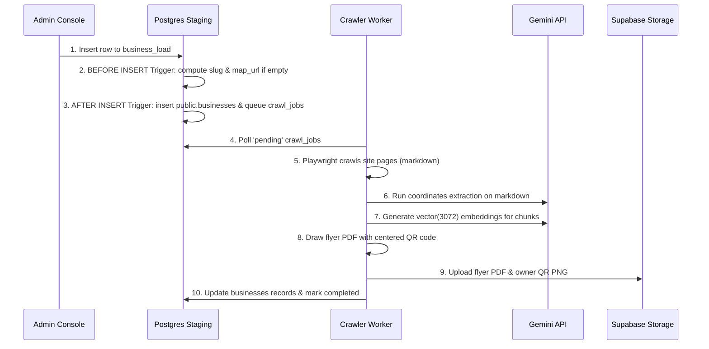

# Frontdesk System Architecture & Data Design

---

## 1. Architectural Components

Frontdesk is built on a decoupled, microservices-oriented Docker architecture containing four core components:

```
  ┌────────────────────────────────────────────────────────┐
  │                   Operator Browser                     │
  │     (React Admin Panel Dashboard - Port 80)           │
  └──────────────────────────┬─────────────────────────────┘
                             │ (Direct API connection)
                             ▼
  ┌────────────────────────────────────────────────────────┐
  │                    Supabase Platform                   │
  │     (PostgreSQL Database with pgvector & Storage)      │
  └──────┬───────────────────▲──────────────────────▲──────┘
         │                   │                      │
         │ (Poll Jobs)       │ (Query Chunks)       │ (Write Chunks / Embeddings)
         ▼                   │                      │
  ┌──────────────┐    ┌──────┴──────┐        ┌──────┴──────┐
  │  Crawler     │    │  Telegram   │        │  Background │
  │  Queue       │    │  Agent Bot  │        │  Crawler    │
  │  (pg_notify) │    │  (Port 8000)│        │  Worker     │
  └──────────────┘    └──────┬──────┘        └─────────────┘
                             │
                             ▼
                  ┌────────────────────┐
                  │   Telegram API     │
                  │ (Owners / Visitors)│
                  └────────────────────┘
```

1. **React Admin Console (`frontdesk-admin`)**: A front-end single-page application served via Nginx. It connects directly to Supabase to manage tenants, view charts, and search crawled vector contents.
2. **AI Agent Telegram Service (`frontdesk-bot`)**: A Python daemon utilizing `python-telegram-bot` and LangGraph. It runs intent routing, fetches vector database records, and communicates with owners/visitors.
3. **Background Crawler Daemon (`frontdesk-crawler`)**: A Python worker container listening for crawl tasks. It uses Playwright to scrape pages, extracts contacts using Gemini, generates embeddings, and compiles PDFs.
4. **PostgreSQL Database (Supabase / pgvector)**: Houses tables for tenant data, crawl queues, escalations, and 3072-dimensional vector chunks.

---

## 2. Core Schema & Database Design

The database contains the following tables:

### 2.1 `public.businesses`
Primary tenant profile table.
* `business_id` (text, primary key): Alphanumeric unique slug (e.g. `dm-hair-care`).
* `business_name` (text, not null): Display name of the business.
* `website_url` (text, not null): Source URL to crawl.
* `agent_name` (text, default 'Kim'): Name of the AI receptionist persona.
* `business_phone` / `business_address` / `business_email` (text): Overrides or extracted contacts.
* `map_url` (text): Link to Google Maps.
* `flyer_url` / `owner_qr_url` (text): Supabase Storage asset paths.
* `admin_chat_id` (text): Telegram Chat ID of the verified business owner.

### 2.2 `public.knowledge_chunks`
Vector store for RAG.
* `id` (uuid, primary key)
* `business_id` (text, foreign key referencing `businesses` on delete cascade)
* `content` (text): Raw text chunk crawled from the site.
* `embedding` (vector(3072)): Semantic embeddings computed by Gemini.

### 2.3 `public.crawl_jobs`
Crawler queue.
* `id` (uuid, primary key)
* `business_id` (text)
* `website_url` (text)
* `status` (text): `'pending' | 'processing' | 'completed' | 'failed'`
* `error_message` (text)

### 2.4 `public.admin_relay`
Active handoff mutes.
* `visitor_chat_id` (text, primary key): Chat ID of the customer.
* `business_id` (text, foreign key referencing `businesses` on delete cascade)
* `is_paused` (boolean): If true, AI ignores this visitor.
* `pending_question` (text): Message that triggered the handoff.

### 2.5 `public.escalations_cache`
Q&A resolved history for AI learning.
* `id` (uuid, primary key)
* `business_id` (text, foreign key referencing `businesses` on delete cascade)
* `question` (text): The visitor query.
* `answer` (text): The owner's resolution.

### 2.6 `public.business_load`
Staging table for ingestion.
* `business_id` (text): Nullable slug.
* `business_name` (text)
* `website_url` (text)
* `status` (text, default 'pending')

---

## 3. Data Ingestion & Crawl Pipeline



---

## 4. Continuous Deployment (CI/CD)

The deployment pipeline is configured using GitHub Actions:
* **Workflow File**: `.github/workflows/deploy.yml`
* **Trigger Model**: `workflow_dispatch` (Manual only). Accessible from the repository Actions tab.
* **Release Tagging**: Once SSH commands deploy the stack successfully, the runner deletes the old `Golden` tag from GitHub, recreates it locally, and force-pushes it back to the remote origin. This links `Golden` to the active production release at all times.
